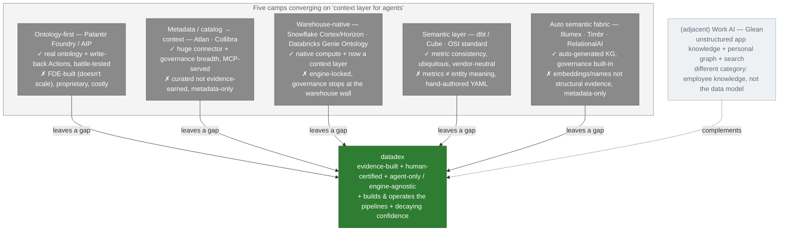

# datadex — competitive deep dive (2026-06-25 · updated 2026-07-05)

Where datadex sits in the "context layer / active ontology for AI agents" race — written for a
**hostile room** (a CDO, a technical buyer, an investor who knows these products). Full candor:
the [capability matrix](#capability-matrix-full-candor) marks where datadex **loses**, and
[§ Where datadex is genuinely behind](#where-datadex-is-genuinely-behind) names the gaps plainly.
Lead with the wedge; concede the gaps fast — that's what makes the rest credible.

Two things shifted the 2026 picture and both are priced in below:
1. **The warehouses now ship context layers too** — Databricks **Genie Ontology** (DAIS 2026) and
   Snowflake **Horizon Context / Cortex Sense / semantic views**. "We're a context layer" is no
   longer differentiating on its own; **engine-agnosticism** is.
2. **The closest peer is Illumex** (Generative Semantic Fabric), not Palantir — an *auto-built*
   semantic graph. The distinction is **how** the model is earned (structural evidence vs embeddings).

---

## TL;DR — the wedge

datadex is the only one doing all of these **at once**:

- **Evidence-built** — the model is earned from real **joins · column lineage · profiling · usage · source SQL**, not hand-declared (dbt/Atlan), FDE-hand-modeled (Palantir), or embedding/name-inferred (Illumex).
- **Human-certified** — nothing goes live unreviewed; production gates are human-only by construction. Trustworthy, not pure-LLM auto.
- **Agent-only & engine-agnostic** — read-only over Oracle · SQL Server · Postgres · BigQuery · files *at once*, via the secure agent. Not locked to one warehouse.
- **It also builds & operates the data** — ingest · transform · run · quality · self-heal. A real DE platform, not a metadata overlay.
- **Deploys air-gapped** — the whole platform **self-hosts inside your network** (hardened, cosign-signed, license-gated images); the LLM seam can point at a self-hosted endpoint so **neither bulk data nor prompts leave**. The SaaS-first incumbents structurally can't match on-prem/regulated.
- **Carries decaying confidence** — reinforcement-aware (EO-0): the model's trust is earned and bleeds toward 0 if usage/evidence stops.

Each *leg* is matchable by someone; the **combination** is the moat.

**Honest gaps (own them):** no write-back **Actions** yet (read-only by choice — Palantir's kinetic layer is real), **no owned compute engine** (warehouses win there), **early** on maturity/ecosystem/scale, and weak on **unstructured/app knowledge** (Glean's turf).

---

## The category: three terms people conflate

| Term | Answers | Example |
|---|---|---|
| **Semantic layer** | "What does this *metric* mean?" — logical→physical query translation | dbt MetricFlow, Cube |
| **Context layer** | "*When, how, under what rules* can an agent use this?" — adds lineage, policy, precedent, sensitivity, freshness, runtime enforcement, MCP delivery | Atlan, Genie Ontology, **datadex Context packet** |
| **Ontology** | A formal model of *entities + relationships* (design-time spec, consumed at runtime) | Palantir Foundry, **datadex ontology** |

datadex spans the bottom two **and** the platform that earns them: it builds the **ontology** from
evidence and serves it as a governed **context** packet. A pure semantic layer (dbt) is one box up.

---

## The 5 camps

> A positioning **quadrant** (auto-built ↔ hand-declared × dashboards ↔ agents) lives in
> [`MERMAID.md` §11](./MERMAID.md). The matrix below is the rigorous version of the same claim.

---

## Capability matrix (full candor)

Legend: ✅ strong · ◐ partial · ➖ not the focus

| Capability | Palantir | Atlan | SF/DBX | dbt/Cube | Illumex | Glean | **datadex** |
|---|:--:|:--:|:--:|:--:|:--:|:--:|:--:|
| Model **auto-built** (not hand-authored) | ◐ | ◐ | ◐ | ➖ | ✅ | ✅ | **✅** |
| Built from **structural evidence** (joins·lineage·profiling·usage) | ◐ | ◐ | ◐ | ➖ | ➖ | ➖ | **✅** |
| **Human-certified** / governed (nothing live unreviewed) | ✅ | ✅ | ◐ | ◐ | ◐ | ◐ | **✅** |
| **Engine-agnostic** (read-only over *any* stack) | ◐ | ✅ | ➖ | ◐ | ✅ | ✅ | **✅** |
| **Builds & operates pipelines** (a DE platform) | ✅ | ➖ | ✅ | ◐ | ➖ | ➖ | **✅** |
| Serves a **context packet** to agents over MCP | ✅ | ✅ | ✅ | ◐ | ✅ | ✅ | **✅** |
| **Evidence-driven confidence + drift decay** | ◐ | ◐ | ➖ | ➖ | ◐ | ➖ | **✅** |
| **Self-hosted / air-gapped / on-prem inference** | ◐ | ➖ | ➖ | ◐ | ➖ | ➖ | **✅** |
| **Write-back Actions** (kinetic) | ✅ | ➖ | ◐ | ➖ | ➖ | ◐ | **➖ deferred** |
| **Enterprise maturity / ecosystem / scale** | ✅ | ✅ | ✅ | ✅ | ◐ | ✅ | **➖ early** |

**Read the wedge as a row pattern:** no column other than datadex is ✅ on *{auto-built + structural-evidence + human-certified + engine-agnostic + builds-pipelines + confidence/drift + air-gapped self-host}* together. datadex is honestly ➖ on the last two rows (write-back Actions, enterprise maturity) — that's the trade.

---

## Per-competitor breakdown

### Palantir Foundry / AIP — *ontology-first*
**What it is:** the most-cited commercial active ontology (Semantic / Kinetic / Dynamic), with real write-back **Actions** and operational decision-making. **Genuine strengths:** maturity, scale, governance, the kinetic layer datadex defers. **The gap:** ontologies are built by **forward-deployed engineers** who hand-model each client — it doesn't scale to a normal data team (industry rule-of-thumb ~1 FTE per 50–100 entity types), it's proprietary, and you migrate onto Foundry. **Why not just use Palantir?** It's the gold standard *if you can afford the FDE army and the platform lock-in*. datadex **earns** the model from evidence and **human-certifies** it — Palantir-grade governance without the hand-modeling, over your existing stack with no migration.

### Atlan / Collibra — *metadata/catalog → context*
**What it is:** a metadata control plane; Atlan frames itself as the "context layer" with four co-located graphs (data · governance · knowledge · active ontology), MCP-served. **Genuine strengths:** enormous connector breadth, mature governance/lineage, real enterprise adoption (Atlan reports up to 5× AI-analyst accuracy from its context layer). **The gap:** it **describes** assets — the semantic model is curated/declared, not earned from structural evidence — and it's **metadata-only** (it doesn't build or move data). **Why not Atlan?** If you want a catalog, use one. datadex's model is *evidence-earned and certified*, and it's the platform that actually produces the tables it describes.

### Snowflake / Databricks — *warehouse-native*
**What it is:** Snowflake (Cortex Analyst, Horizon Context, Cortex Sense, semantic views) and Databricks (Unity Catalog Metrics, **Genie Ontology** — "ontorank," learns from 50+ apps). **Genuine strengths:** native compute, deep integration, and now a real context layer for users already all-in. **The gap:** structurally **engine-locked** — Cortex/Genie only see data *inside their own platform* (Genie caps ~30 tables per Space; Unity governance "doesn't travel beyond its perimeter"), they're reporting-layer-centric, and the consumption-pricing model rewards keeping data in. **Why not the warehouse's own?** If 100% of your data and future lives in one engine, native is simplest. The moment your estate is hybrid (Oracle + SQL Server + Snowflake + files), only an **engine-agnostic** read layer can reason across all of it — which is datadex.

### dbt / Cube — *semantic layer (+ OSI)*
**What it is:** the ubiquitous metric layer; dbt's MetricFlow is the declarative spec behind the **Open Semantic Interchange** standard (v1.0, Jan 2026). **Genuine strengths:** metric consistency, vendor-neutral standardization, massive adoption. **The gap:** it standardizes what a **metric** means (revenue), not what an **entity** is and how entities relate (Claim ↔ Member ↔ Provider) — and it's **hand-authored YAML** with no runtime governance/lineage/precedent at the agent boundary. **Why not dbt?** It's complementary, not competing — datadex **conforms to OSI at the boundary**. A metric layer answers "how much revenue"; datadex answers "what *is* a Claim, how is it produced, how fresh is it, and may an agent trust this Link."

### Illumex / Timbr / RelationalAI — *auto semantic fabric*
**What it is:** the nearest peer — Illumex's Generative Semantic Fabric auto-generates a virtual knowledge graph of semantic embeddings from metadata + industry ontologies, governance built-in ("semantic flywheel"). **Genuine strengths:** automatic (no hand-YAML), governance-aware, real accuracy lifts. **The gap:** the model is inferred from **embeddings + names + industry priors**, not **structural evidence** (real joins/column-lineage/usage); it's **metadata-only** (doesn't build/operate pipelines); human-certification is lighter. **Why not Illumex?** Closest fight — win it on *grounding and governance*: datadex's Links come from how data **actually flows** (an authored `ON` clause, observed lineage, real traversal usage) and are **gated behind human certification**, not generated from how columns are *named*.

### Glean — *work AI (adjacent)*
**What it is:** enterprise search + work assistant over apps (Confluence, Slack, Jira…) with a company + personal knowledge graph; ~$200M ARR. **Genuine strengths:** best-in-class unstructured/app knowledge and search, behavioral personalization. **The gap / why it's adjacent:** different category — it models **employee app-knowledge**, not the **structured data-platform** entity model. It complements datadex (unstructured context) rather than competing for the governed data ontology.

---

## Where datadex is genuinely behind

Say these before you're asked:

1. **No write-back Actions yet** — read-only by choice (the kinetic/Action layer is deferred). Palantir does this today; for "agent takes a governed action," datadex isn't there.
2. **No owned compute engine** — datadex reasons over metadata and routes work to the secure agent; it doesn't have native vectorized compute the way the warehouses do.
3. **Early on maturity / ecosystem / scale** — no enterprise reference logos, limited connector breadth, unproven at billions of entities. Atlan/Glean/warehouses dwarf it here.
4. **Weak on unstructured / app knowledge** — structured-data focus; Glean owns the wiki/ticket/PDF context.

None of these break the wedge — but pretending they don't exist does.

---

## Cross-question bank

- **"Snowflake/Databricks already ship a context layer — why you?"** They see only data *inside their own engine* (Genie ~30-table cap; governance stops at the warehouse wall) and their economics reward keeping data in. datadex reasons read-only across a hybrid estate (Oracle + SQL Server + Snowflake + Databricks + files) at once.
- **"Why not Palantir?"** Gold standard, but FDE-hand-built (doesn't scale, costly) and you migrate onto Foundry. datadex earns the model from evidence + human-certifies — the governance without the FDE army, over your existing stack.
- **"Isn't this just dbt / OSI?"** dbt standardizes *metrics* (hand-YAML); datadex earns the *entity* model and serves a governed context packet (lineage + provenance + confidence + certified Links). We **conform** to OSI at the boundary, not compete.
- **"Illumex/Atlan also auto-build a semantic graph — what's different?"** They generate from embeddings/metadata and stay metadata-only. datadex earns Links from **structural evidence** (real joins/lineage/usage), **gates them behind human certification**, and **operates the pipelines** — grounded in how data flows, not how columns are named.
- **"You're read-only — isn't that a toy?"** Read-only is a deliberate scope choice that makes the trust story airtight (we can't break your systems). It's also where the durable value is right now: a *correct, governed model + perfect read context*. Actions are sequenced after that's nailed.
- **"What stops a warehouse from just adding this?"** Engine-agnosticism and the evidence+certify loop run counter to their walled-garden economics — they're incentivized to keep data *in*, not to reason over data they don't host.
- **"Can this run fully in our network / air-gapped, with nothing leaving?"** Yes — datadex self-hosts as hardened, cosign-signed, license-gated images (control plane + secure agent) on an internal Linux host, and the LLM seam can point at a self-hosted OpenAI-compatible endpoint, so **neither bulk data nor prompts leave**. That's the deployment the SaaS-first incumbents (Atlan, Glean, the warehouses' own AI) structurally can't offer — and the wedge for regulated / egress-blocked buyers.

---

## Sources

- [Colrows — Why Snowflake & Databricks can't be your semantic layer](https://colrows.com/blogs/snowflake-databricks-semantic-layer/)
- [Colrows — Cortex Analyst vs Genie: where warehouse-native AI stops](https://colrows.com/blogs/cortex-analyst-vs-genie/)
- [Atlan — Context layer vs semantic layer](https://atlan.com/know/context-layer-vs-semantic-layer/) · [Active ontology, the 2026 default](https://atlan.com/know/what-is-active-ontology/)
- [Atlan — What is Genie Ontology? (Databricks)](https://atlan.com/know/ai-agent/databricks/genie-ontology/)
- [Illumex — Generative Semantic Fabric](https://illumex.ai/blog/automating-context-for-enterprise-genai-at-scale-generative-semantic-fabric-explained/)
- [Glean — knowledge graph guide](https://www.glean.com/resources/guides/glean-knowledge-graph)
- [SiliconANGLE — Snowflake, Databricks & the battle for the agentic client](https://siliconangle.com/2026/06/07/snowflake-databricks-model-makers-battle-agentic-client-ai-back-end/)
- [Constellation — Snowflake Summit 2026: data, context, and action](https://www.constellationr.com/research/blog/snowflake-summit-2026-redrawing-boundary-between-data-context-and-action)

> Current-state claims about datadex are code-verified (see [`MERMAID.md`](./MERMAID.md) §10–13);
> competitor claims are sourced above and reflect mid-2026 positioning.
