# datadex architecture — Mermaid (single source)

The **single source** for datadex's architecture diagrams. Author here in Mermaid, then
paste any block into an AI/diagram tool that renders Mermaid (Claude, ChatGPT, Eraser,
Napkin, Excalidraw, GitHub, Notion, mermaid.live) to get a visual.

- The earlier **D2 / C4 + PNG** set is archived under [`_archive/`](./_archive/) (frozen — not maintained).
- Sanity-check any edit instantly at <https://mermaid.live>.

---

## Scope today (decided 2026-06-24)

datadex's job **right now** is two things:

1. **Auto-build a good, evidence-driven ontology** — Objects · Properties · Links, earned from evidence and human-certified.
2. **Give AI the perfect READ context** over it — the Context packet ("company brain").

**Ontology Actions / write-backs are deferred.** The AI *reads and reasons*; it does not
yet write back to your systems. Every diagram below reflects that read-only scope.

---

## The brand palette (paste into any block)

Mermaid blocks don't share definitions, so each diagram repeats the `classDef` lines it
needs. The full set, matching the datadex diagram brand:

```text
classDef person    fill:#08427b,stroke:#052e56,color:#fff;
classDef container fill:#1168bd,stroke:#0b4884,color:#fff;
classDef store     fill:#1168bd,stroke:#0b4884,color:#fff;
classDef external  fill:#8a8a8a,stroke:#5f5f5f,color:#fff;
classDef state     fill:#1168bd,stroke:#0b4884,color:#fff;
classDef ok        fill:#2e7d32,stroke:#1b5e20,color:#fff;
classDef bad       fill:#b23b3b,stroke:#7f2626,color:#fff;
classDef done      fill:#2e7d32,stroke:#1b5e20,color:#fff;
classDef prog      fill:#1168bd,stroke:#0b4884,color:#fff;
classDef early     fill:#e8a33d,stroke:#b97e22,color:#2b2b2b;
classDef none      fill:#d9dde2,stroke:#aab2bd,color:#2b2b2b;
classDef deferred  fill:#eef1f4,stroke:#aab2bd,stroke-dasharray:4 4,color:#5f6b78;
classDef proposed  fill:#6a4c93,stroke:#4a2c73,color:#fff;   # net-new in the target state
```

Zone (subgraph) styling — control plane vs data plane:
```text
style control  fill:#eef4fb,stroke:#0b4884,color:#0b4884
style datazone fill:#fbf2e9,stroke:#cc6600,stroke-dasharray:5 5,color:#cc6600
```

## Cheatsheet (define your own structures)

```text
flowchart TB | LR        direction: top-bottom or left-right
A[Box]                   rectangle        A([Pill])     rounded
A[(Cylinder)]            store/db          A{Diamond}    decision
A:::container            apply a class     class A,B done   apply to many
A --> B                  solid edge        A -->|label| B   labelled
A ==> B                  thick edge        A -.-> B         dashed
A -.->|label| B          dashed + label    "<br/>"          line break in a label
subgraph id["Title"] ... end               group (quote titles with spaces/punctuation)
%% a comment
```
> Tip: if a label has `()` `/` `·` `:`, wrap the whole label in double quotes — `A["a/b (c)"]`.

---

## 1 · Where we sit

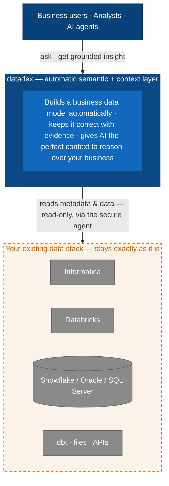
> We do **not** replace Informatica / Databricks / Snowflake — we add the brain they don't have: an always-current model + perfect context for AI.

## 2 · How it works

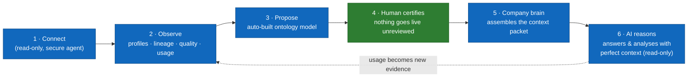
> Your data never leaves your environment; the model is earned from evidence and approved by a human. **Governed write-back Actions are deferred** — today the AI reads and reasons.

## 3 · The living loop (the drift answer)

```mermaid
flowchart LR
  drift["Source schema or data DRIFTS<br/>(a column changes, a feed breaks)"]:::bad
  observe["Observe<br/>re-profile on every run"]:::state
  propose["Propose<br/>update the model"]:::state
  certify["Certify<br/>human approves the change"]:::ok
  serve["Serve<br/>fresh context to AI"]:::state
  use["Use<br/>AI answers & monitors<br/>with grounded context"]:::state
  drift -->|"detected automatically"| observe
  observe -->|"evidence changes → confidence shifts"| propose
  propose -->|"proposed diff"| certify
  certify -->|"approved"| serve
  serve -->|"grounded context"| use
  use -.->|"usage = new evidence"| observe

  classDef state fill:#1168bd,stroke:#0b4884,color:#fff;
  classDef ok fill:#2e7d32,stroke:#1b5e20,color:#fff;
  classDef bad fill:#b23b3b,stroke:#7f2626,color:#fff;
```
> Nothing is ever silently wrong: drift lowers confidence → forces a fresh proposal → human re-certifies. Today the loop serves **READ** context to AI; governed write-back Actions are deferred.

## 4 · datadex architecture — current state

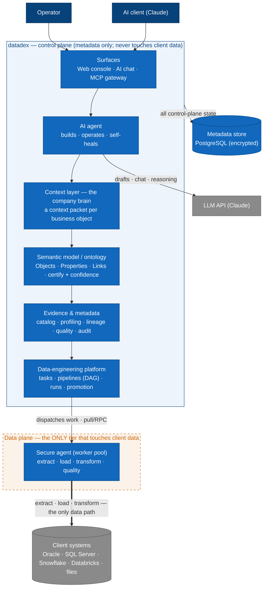
> Reads top-to-bottom: platform earns evidence → evidence builds the model → model becomes the brain → **AI reads grounded context**. The control plane sees only metadata. *(Governed write-back Actions are deferred.)*

## 5 · Deployment topology (data residency)

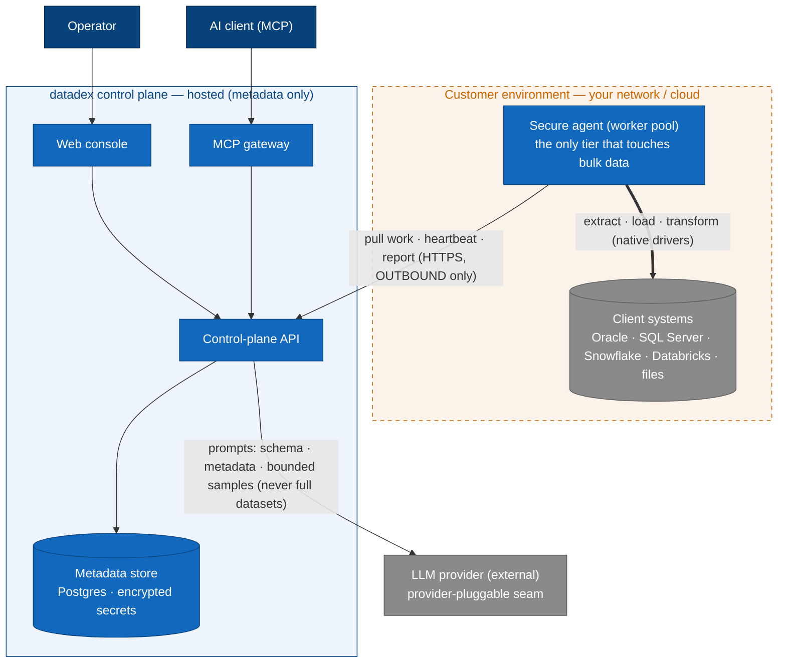
> **Bulk client data never leaves your environment** — only the secure agent reads it. The agent reaches **out** to the control plane (HTTPS outbound; no inbound holes in your firewall). The control plane holds metadata + encrypted secrets; the LLM sees prompts only.

## 6 · Semantic-model shape (the brain, made concrete)

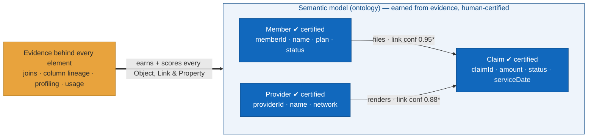
> **Objects** (business entities) carry certified **Properties**; **Links** are certified and confidence-scored (governed traversal, ADR 0006/0024). The whole model is *earned* from evidence, not hand-declared. Ontology **Actions / write-backs** (e.g. AdjudicateClaim) are **deferred**. *(confidence numbers illustrative)*

## 7 · Context-packet anatomy ("perfect context for AI")

```mermaid
flowchart LR
  subgraph packet["Context packet — one Object (e.g. Claim) · ontology.get_context (ADR 0027)"]
    direction TB
    props["Properties + provenance<br/>the semantic meaning of each field"]:::part
    backing["Backing Task(s) + column lineage<br/>how the table is produced & kept fresh"]:::part
    gov["Governance<br/>certification · connection capabilities"]:::part
    fresh["Data freshness<br/>latest DQ score + profile time"]:::part
    links["Certified Links<br/>Member · Provider (governed traversal)"]:::part
    sample["(optional) live sample<br/>bounded real rows via secure agent"]:::partopt
    conf["Packet confidence<br/>reinforcement-aware (EO-0, in progress)"]:::conf
    traces["Action decision-traces<br/>(part of the design — inactive while Actions deferred)"]:::deferred
  end
  agent["AI agent / LLM"]:::person
  packet ==>|"ONE read, not ~8 stitched calls"| agent
  agent -->|"reasons grounded, not guessing"| out["Trustworthy answer / analysis"]:::ok

  classDef part fill:#1168bd,stroke:#0b4884,color:#fff;
  classDef partopt fill:#1168bd,stroke:#0b4884,color:#fff,stroke-dasharray:4 4;
  classDef conf fill:#e8a33d,stroke:#b97e22,color:#2b2b2b;
  classDef deferred fill:#eef1f4,stroke:#aab2bd,stroke-dasharray:4 4,color:#5f6b78;
  classDef person fill:#08427b,stroke:#052e56,color:#fff;
  classDef ok fill:#2e7d32,stroke:#1b5e20,color:#fff;
  style packet fill:#eef4fb,stroke:#0b4884,color:#0b4884
```
> What "give AI the perfect context" concretely means: a single governed read that hands the agent everything to reason about one business Object — assembled deterministically from existing evidence (built, ADR 0027). **Packet confidence** is the in-flight piece (EO-0). **Action decision-traces** are part of the packet design but inactive while Actions are deferred. `ontology.find_context` does the same from a natural-language query (deterministic ranking, no LLM).

---

## Target state (proposed) — 2026-06-24

> **Proposed, NOT built.** Derived from 2026-06-24 market research (`/last30days` + web; see [ADR 0029](../adr/0029-the-target-state-context-layer-is-hybrid-retrieval-plus-cited-answers-read-only.md)). The market converged on datadex's exact category ("active ontology" + "context layer"); these diagrams show the four read-side gaps to become best-in-class.
> **Purple = net-new in the target state.** Scope unchanged: read-only (ontology Actions / write-backs stay deferred). Wedge to keep legible on every frame: **evidence-built + human-certified + agent-only**.

### 8 · Retrieval architecture — current vs proposed

**8a — current (graph-only)**

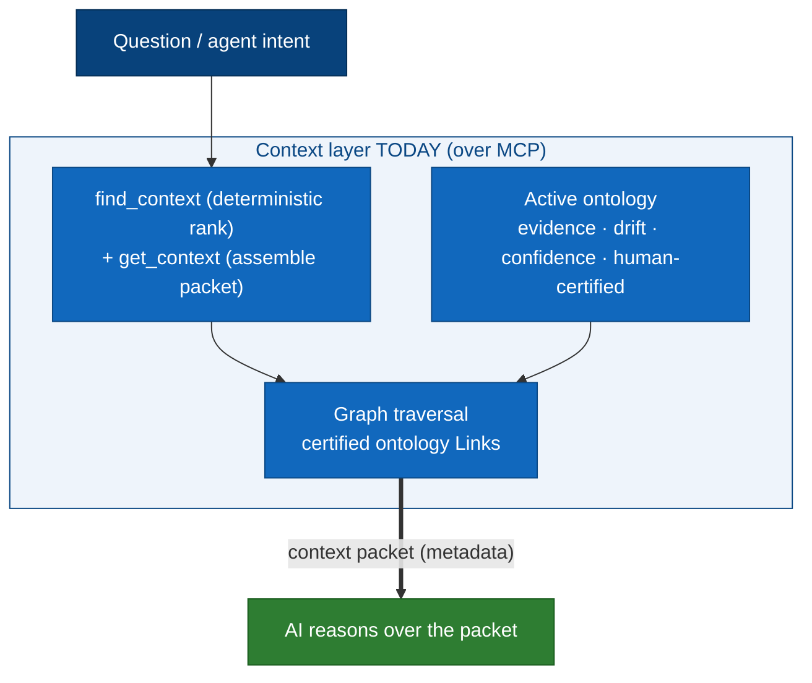

**8b — proposed (hybrid retrieval + cited answer)**

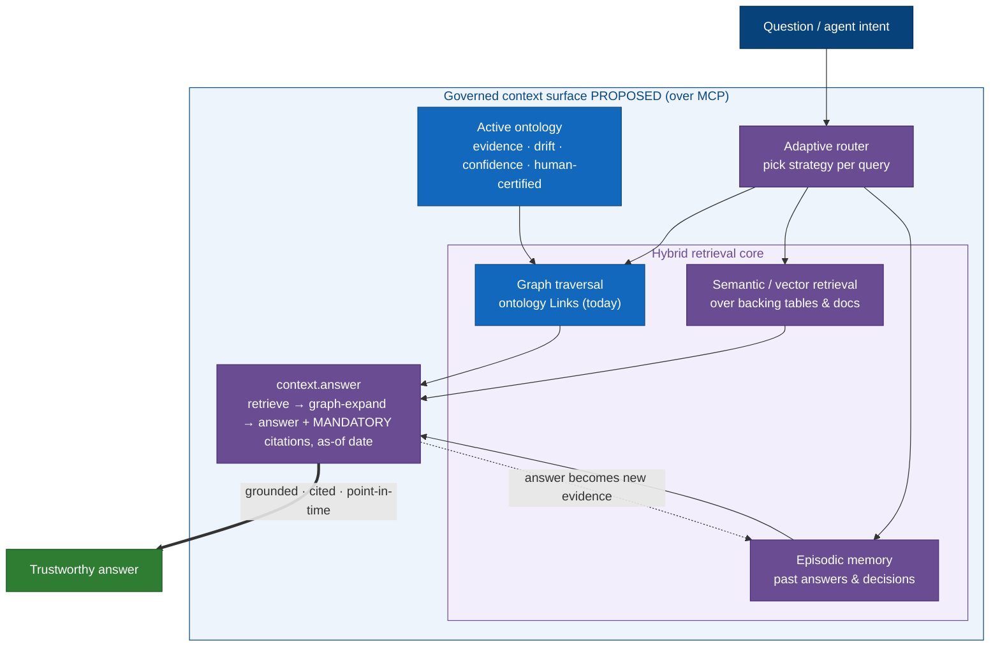

### 9 · Context packet — current vs proposed

**9a — current**

```mermaid
flowchart LR
  subgraph packet["Context packet TODAY — one Object"]
    direction TB
    props["Properties + provenance"]:::part
    backing["Backing Task(s) + column lineage"]:::part
    gov["Governance · certification · capabilities"]:::part
    fresh["Data freshness · DQ + profile time"]:::part
    links["Certified Links (graph traversal)"]:::part
    conf["Packet confidence (EO-0, in progress)"]:::conf
    traces["Action decision-traces (deferred)"]:::deferred
  end
  packet ==>|"assembled, metadata-only"| out["AI reasons over the packet"]:::ok

  classDef part fill:#1168bd,stroke:#0b4884,color:#fff;
  classDef conf fill:#e8a33d,stroke:#b97e22,color:#2b2b2b;
  classDef deferred fill:#eef1f4,stroke:#aab2bd,stroke-dasharray:4 4,color:#5f6b78;
  classDef ok fill:#2e7d32,stroke:#1b5e20,color:#fff;
  style packet fill:#eef4fb,stroke:#0b4884,color:#0b4884
```

**9b — proposed (context packet++)**

```mermaid
flowchart LR
  subgraph packet["Context packet++ PROPOSED — one Object, as-of a date"]
    direction TB
    props["Properties + provenance"]:::part
    backing["Backing Task(s) + column lineage"]:::part
    gov["Governance · certification · capabilities"]:::part
    fresh["Data freshness · DQ + profile time"]:::part
    links["Certified Links (graph traversal)"]:::part
    vecs["Semantic neighbours (vector retrieval)"]:::proposed
    epis["Episodic memory (prior answers / decisions)"]:::proposed
    temporal["Point-in-time as-of (event + ingestion time)"]:::proposed
    conf["Packet confidence (reinforcement-aware, EO-0)"]:::conf
    traces["Action decision-traces (deferred)"]:::deferred
  end
  packet ==>|"context.answer → cited, grounded"| out["Trustworthy answer / analysis"]:::ok

  classDef part fill:#1168bd,stroke:#0b4884,color:#fff;
  classDef proposed fill:#6a4c93,stroke:#4a2c73,color:#fff;
  classDef conf fill:#e8a33d,stroke:#b97e22,color:#2b2b2b;
  classDef deferred fill:#eef1f4,stroke:#aab2bd,stroke-dasharray:4 4,color:#5f6b78;
  classDef ok fill:#2e7d32,stroke:#1b5e20,color:#fff;
  style packet fill:#eef4fb,stroke:#0b4884,color:#0b4884
```

> **The four gaps, sequenced value-first (ADR 0029):** (1) `context.answer` cited synthesis - BUILD, first; (2) hybrid vector retrieval + adaptive router - vector store ADOPT-at-boundary; (3) temporal / as-of packet; (4) episodic / decision memory - where the deferred Action-traces later plug in.

---

## Deep-dive diagrams — 2026-06-25 (code-verified current · market-researched target)

> The **current** halves below are verified against the running code (file refs inline), not the pitch deck. The **proposed** halves are derived from 2026 market research — agent zero-trust / fine-grained authz, the "active ontology + context layer" category, and self-healing-pipeline patterns. **Purple = net-new in the target state.** The wedge stays legible on every frame: **evidence-built + human-certified + agent-only**, and the human-only governance gates stay human-only even as autonomy grows.
> Sources: [Cerbos — MCP & zero-trust](https://www.cerbos.dev/blog/mcp-and-zero-trust-securing-ai-agents-with-identity-and-policy) · [Zero-Trust Identity for Agentic AI (arXiv 2505.19301)](https://arxiv.org/html/2505.19301v2) · [Atlan — Active Ontology, the 2026 default](https://atlan.com/know/what-is-active-ontology/) · [Ontologies, Context Graphs & Semantic Layers](https://contextandchaos.substack.com/p/ontologies-context-graphs-and-semantic) · [Self-healing data pipelines (6-agent pattern)](https://medium.com/codetodeploy/agentic-data-infrastructure-i-built-a-self-healing-data-pipeline-system-8eb87f16f30e).

### 10 · Trust & security model — current vs proposed

**10a — current (code-verified)**

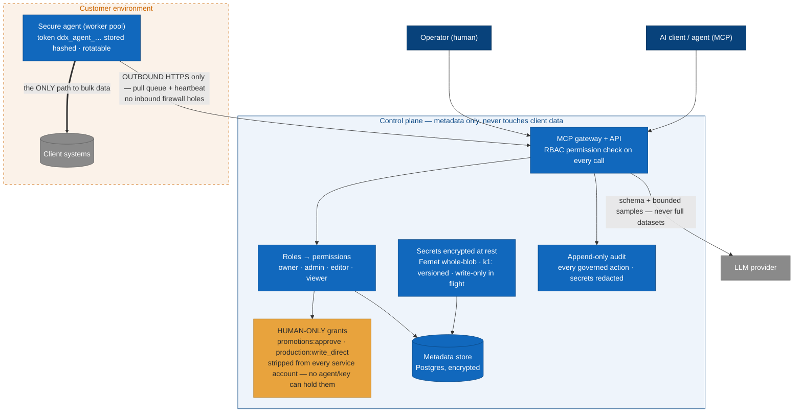
> The trust story in one read: **bulk data never leaves the customer env** (only the secure agent touches it, reaching *out* over HTTPS — no inbound holes); the **control plane is metadata-only**; secrets are **encrypted write-only**; and the two grants that admit logic to production (`promotions:approve`, `production:write_direct`) are **human-only by construction** — stripped from every service account, so no agent or API key can cross them (`store_primitives.py` · `secrets.py` · `store_mixins/agents.py`).

**10b — proposed (agentic zero-trust target state)**

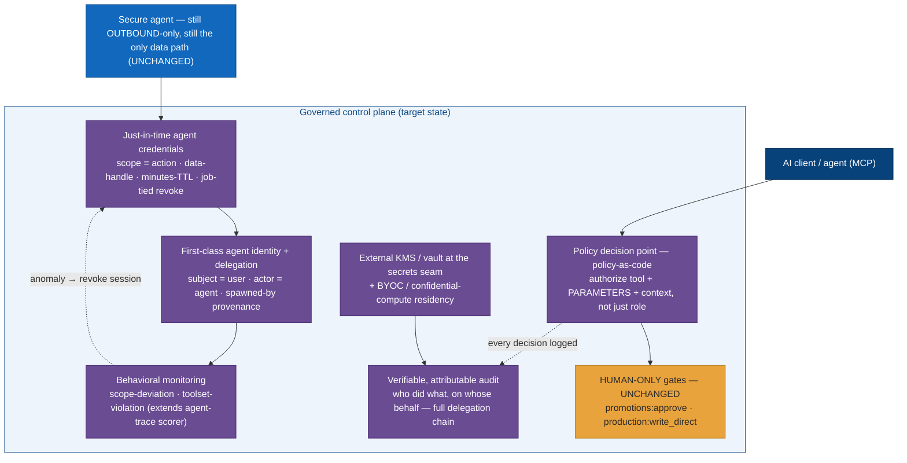
> Where the market is going (Cerbos / Microsoft Entra Agent ID / arXiv 2505.19301): coarse role-strings give way to a **policy decision point** that authorizes the *parameters* of a tool call, **short-lived job-scoped credentials** replace the long-lived bearer token, agents get a **first-class identity with subject↔actor delegation provenance**, and **behavioral monitoring** (the agent-trace scorer is the seed) revokes a misbehaving session. Note what does **not** change: outbound-only data path, metadata-only control plane, and the human-only production gates.

### 11 · Where datadex sits — competitive map + the wedge

**11a — the 2026 landscape (positioning)**

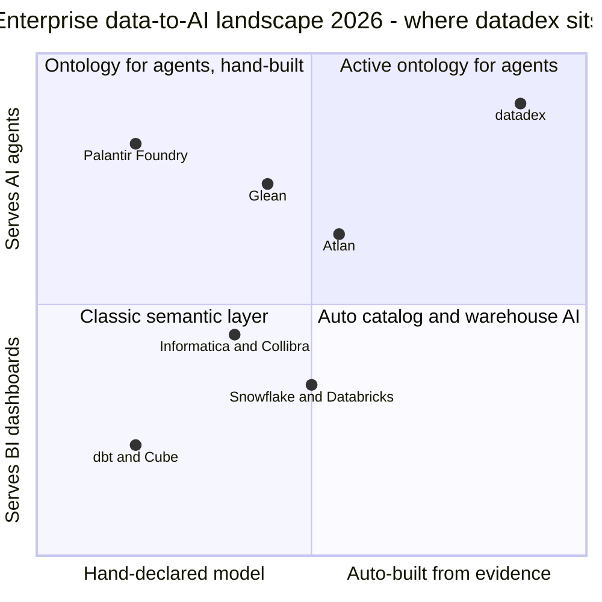
> The prize quadrant is **top-right: an active ontology that serves agents AND is built automatically.** Palantir owns the agent-ontology idea but builds it by hand (forward-deployed engineers — doesn't scale to a normal data team); Atlan/Collibra automate but stay catalog-first; dbt/Cube standardise *metrics*, not entity *meaning*. datadex is the only one earning the model from evidence while keeping it agent-first.

**11b — the wedge (why datadex wins its corner)**

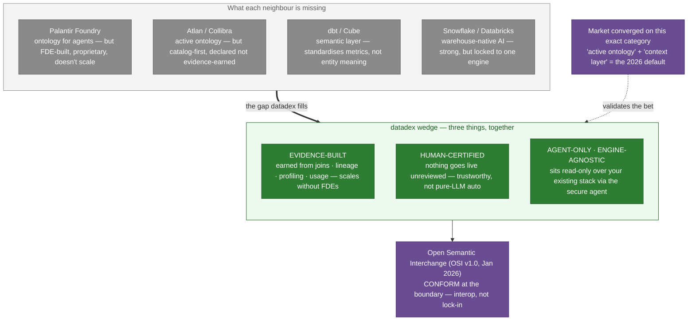
> No single competitor is doing all three at once. Each leg alone is matchable; **the combination is the moat** — and OSI gives us a standards-based on-ramp (conform at the boundary) instead of a lock-in fight. (Atlan publicly reports up to 5× AI-analyst accuracy from a context layer — the category's value is already market-proven.)
>
> **→ Full competitive deep dive** (5-camp map, capability matrix, per-competitor breakdown, honest gaps, cross-question bank): [`COMPETITIVE.md`](./COMPETITIVE.md).

### 12 · The agent's build → operate → self-heal loop — current vs proposed

**12a — current (code-verified)**

```mermaid
flowchart LR
  subgraph build["BUILD — intelligence (BI-1/2/3, ADR 0023)"]
    direction TB
    b1["Infer load strategy from the data<br/>full · incremental · merge"]:::container
    b2["Quality-in-build<br/>checks authored with the pipeline"]:::container
    b3["Idempotent builds<br/>re-runnable · exactly-once on a declared key"]:::container
  end
  subgraph operate["OPERATE — self-heal triage (Track 2)"]
    direction TB
    detect["Detect<br/>run fails → typed error (taxonomy)"]:::container
    diagnose["Diagnose<br/>deterministic lineage walk → EARLIEST broken producer"]:::container
    propose["Propose remediation<br/>(error · root-cause · quality · load) → ONE governed fix"]:::container
    detect --> diagnose --> propose
  end
  human["Human approves<br/>one-click: run.retry · task.update · incident.create"]:::gate
  build ==> operate
  propose -->|"auto = False — invariant"| human
  human -.->|"approved fix applied"| operate

  classDef container fill:#1168bd,stroke:#0b4884,color:#fff;
  classDef gate fill:#e8a33d,stroke:#b97e22,color:#2b2b2b;
  style build fill:#eef4fb,stroke:#0b4884,color:#0b4884
  style operate fill:#eef4fb,stroke:#0b4884,color:#0b4884
```
> The agent already does the hard part most "AI data engineer" demos skip: when a gold run fails because silver wrote 0 rows because bronze broke, it walks the lineage DAG to the **earliest** broken producer and proposes the fix *there*, not at the symptom — then stops. `propose_remediation` carries an **`auto = False` invariant**: it presents "here's the fix I propose — approve it," it never self-applies (`codegen.py: diagnose_upstream_root_cause` + `propose_remediation`).

**12b — proposed (self-healing target state, wedge intact)**

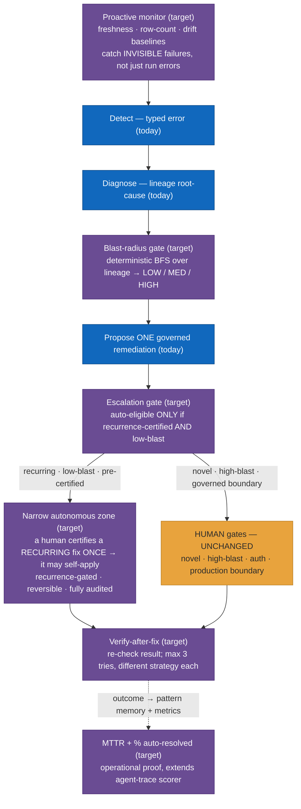
> The market's best self-healing systems add four things datadex is well-placed for: a **proactive monitor** (catch freshness/row-count drift, not only run failures), a **deterministic blast-radius gate** (we already have lineage + impact), a **verify-after-fix loop**, and **MTTR / %-auto metrics**. The one genuinely new policy is a **narrow autonomous zone** — and datadex takes it on-brand: a fix may self-apply *only* after a human has **certified that recurring pattern once** (recurrence-gated, the same DIAL-KG mechanism behind evidence-driven links). That keeps the documented stance — *governed proposals, no ungoverned background autonomy* — while still earning the MTTR wins. Human-only production gates never become machine-eligible.

### 13 · Pipeline DAG execution — how a pipeline actually runs (current, code-verified)

> Grounded in `routes/execution.py`. A pipeline is a **DAG of Tasks** (nodes) joined by **edges** (`from_task_id → to_task_id`). Execution is **control-plane orchestrated, agent-executed**: the control plane decides *what is ready*, the secure agent (the only tier that touches client data) *does the work*. Nothing here is aspirational — these are the real functions.

**13a — DAG structure & dependency-gated advance**

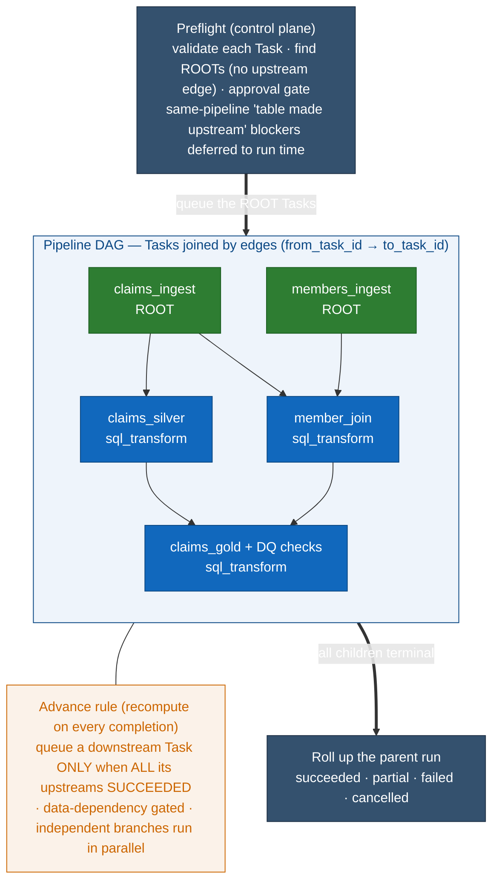
> Roots start first; `member_join` waits for **both** `claims_ingest` and `members_ingest`; `claims_gold` waits for both of its parents. If a Task **fails**, the per-failure policy decides the blast: **`skip_downstream`** (default) BFS-cancels only that Task's not-yet-started descendants — independent branches keep running; **`halt`** cancels every un-started Task in the run; **`continue`** cancels nothing. A *running* Task is never force-cancelled — it's left to finish. A failing **critical DQ check** fails the run (and cascades as a failure); a warning is advisory.

**13b — one Task-run's lifecycle (through the secure agent)**

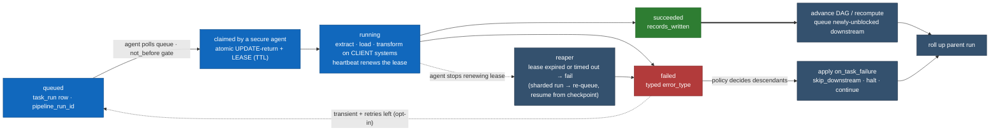
> The control plane only ever *queues* work; the **agent claims it with a lease and reaches OUT** (no inbound path) to run extract/load/transform on the client systems, renewing the lease via heartbeat. If the agent dies mid-run the **reaper** catches the expired lease and fails or re-queues it (a sharded run resumes mid-file from its committed checkpoint, ADR 0012). A just-failed run that is *transient* and has retries left re-enters `queued` behind a `not_before` backoff (auto-retry is opt-in). Every terminal child triggers a roll-up of the parent pipeline run.
