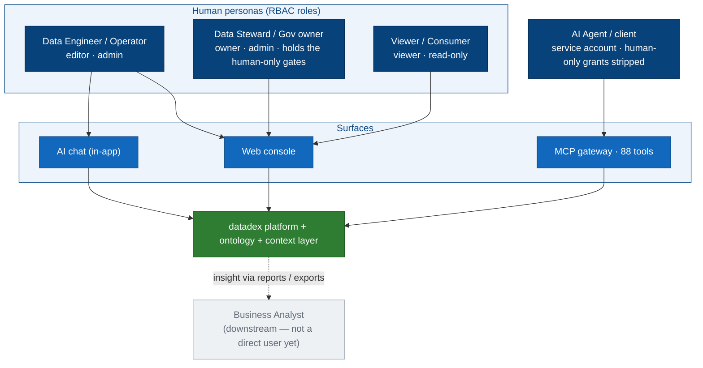
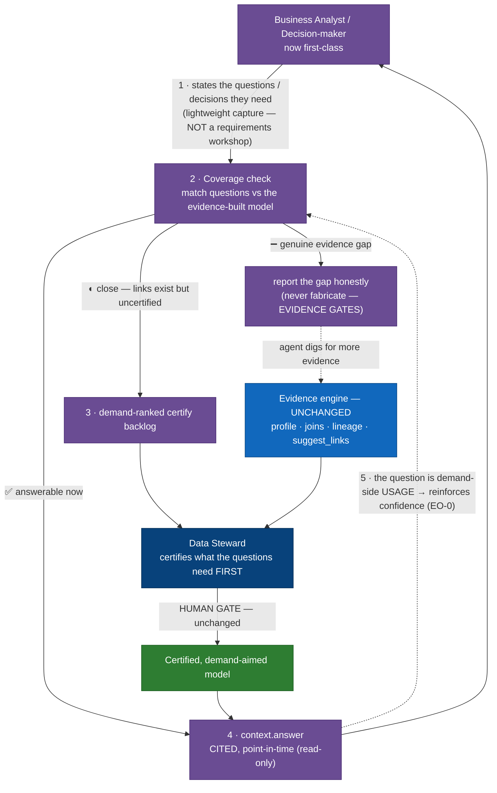
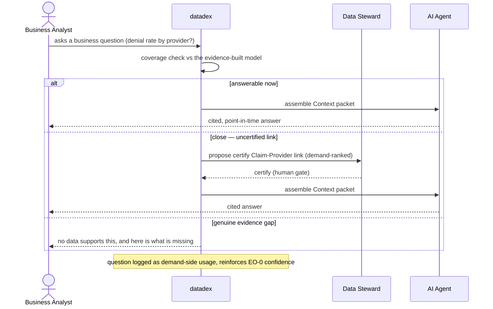

# datadex — personas & user flows (2026-06-25)

High-level view of **who interacts with datadex and how**. The **current state** is code-verified
(it reflects the platform as it runs today). The **target state** is *proposed* — it shows the
**hybrid flow** where the bottom-up evidence engine meets the demand-side questions a business user
actually has (purple = net-new). Scope is unchanged: **read-only, evidence-built, human-certified,
agent-only**; the AI reasons and answers, it does not write back.

---

## Personas

| Persona | RBAC / nature | What they want | Status today |
|---|---|---|---|
| **Data Engineer / Operator** | `editor` / `admin` | Connect sources, build & run pipelines, fix incidents | ✅ first-class user |
| **Data Steward / Governance owner** | `owner` / `admin` (holds the **human-only** gates: `promotions:approve`, `production:write_direct`) | Certify the model, approve promotions, keep trust intact | ✅ first-class user |
| **AI Agent / AI client** | service account over **MCP** (human-only grants stripped) | Read governed context to reason correctly | ✅ first-class *non-human* user |
| **Viewer / Consumer** | `viewer` | See runs, catalog, the model — read-only | ✅ present |
| **Business Analyst / Decision-maker** | *(human, demand-side)* | Get trustworthy answers to business questions | ⚠️ **indirect today** — becomes first-class in the target state |

> The honest gap: today datadex is **operated** by engineers + stewards and **consumed** by AI agents.
> The business analyst sits *downstream* — they receive insight secondhand, they don't drive the model.
> The target state brings them **into** the loop without abandoning the evidence-first thesis.

---

## Current state (code-verified)

### 1 · Who touches the platform today, through which surface

### 2 · The end-to-end flow today

```mermaid
flowchart LR
  de["Data Engineer"]:::person
  ds["Data Steward"]:::person
  ag["AI Agent (MCP)"]:::person
  ba["Business Analyst"]:::muted

  de -->|"1 · connect & discover (read-only, secure agent)"| disc["Sources profiled · cataloged"]:::container
  disc --> build["2 · build & operate<br/>tasks · pipelines (DAG) · runs · quality · self-heal"]:::container
  de --> build
  build --> propose["3 · agent PROPOSES the ontology<br/>from evidence: joins · lineage · profiling · usage"]:::container
  propose -->|"4 · review & CERTIFY (human gate)"| ds
  ds --> model["Certified model + Context packet"]:::ok
  model -->|"5 · find_context / get_context (MCP)"| ag
  ag --> reason["AI reasons (read-only)"]:::ok
  reason -.->|"insight flows out secondhand"| ba

  classDef person fill:#08427b,stroke:#052e56,color:#fff;
  classDef container fill:#1168bd,stroke:#0b4884,color:#fff;
  classDef ok fill:#2e7d32,stroke:#1b5e20,color:#fff;
  classDef muted fill:#eef1f4,stroke:#aab2bd,color:#5f6b78;
```

> Read top-left to right: engineers **build & operate**, the agent **proposes** the model from real
> evidence, the steward **certifies** it, and AI agents **consume** the governed context. The model is
> earned from data — *no one is interviewed about requirements*. The business analyst (greyed) only
> sees the output; they have no on-ramp into the loop. That's the gap the target state closes.

---

## Target state (proposed) — the hybrid: demand meets the ground-up

The business analyst becomes a **first-class demand-side persona**. Their questions don't *build* the
model (evidence still does that) — they **steer** it: prioritise what to certify, validate coverage,
and reinforce confidence. Three guardrails keep it on-thesis.

### 3 · The hybrid flow

> **The "meet halfway":** demand (questions) tells the machine *where to look*; the machine still does
> the *building* from evidence. This is the scalable middle between Palantir (all-human, demand-first,
> hand-built) and pure-auto (supply-only, models data nobody asked about).

### 4 · One question, end to end (runtime interaction)

### The three guardrails (what keeps it on-thesis)

1. **Evidence still gates.** Demand prioritises and validates coverage; it **never fabricates** an entity with no backing data. Stays true to *"an Object is earned, not asserted."*
2. **Human still certifies.** Questions rank the backlog; a steward still approves what goes live. The human-only production gates are unchanged.
3. **Read-only, still.** The flow stops at a **cited answer**, not an action/write-back. Answering is the serve layer ([ADR 0029](../adr/0029-the-target-state-context-layer-is-hybrid-retrieval-plus-cited-answers-read-only.md) `context.answer`); ontology Actions stay deferred.

---

## What changes per persona

| Persona | Today | In the hybrid target state |
|---|---|---|
| **Data Engineer** | Builds & operates pipelines | Unchanged — still the builder |
| **Data Steward** | Certifies the whole proposed model | Certifies **demand-ranked** first — effort aimed at what the business actually asks |
| **AI Agent** | Reads context, reasons | Also delivers **cited** answers (`context.answer`) |
| **Business Analyst** | Downstream, secondhand insight | **First-class**: asks questions → gets coverage feedback + cited answers; their questions steer the model |
| **Viewer** | Read-only views | Unchanged |

> Companion docs: architecture diagrams → [`MERMAID.md`](./MERMAID.md) · competitive deep dive → [`COMPETITIVE.md`](./COMPETITIVE.md).
